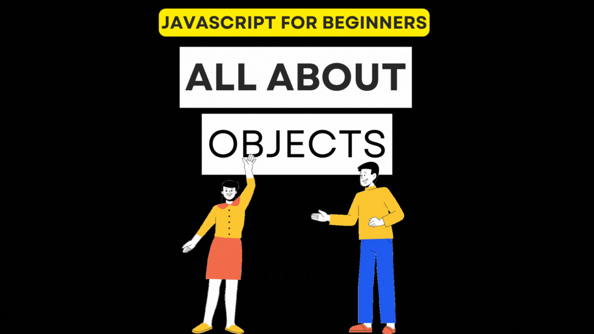
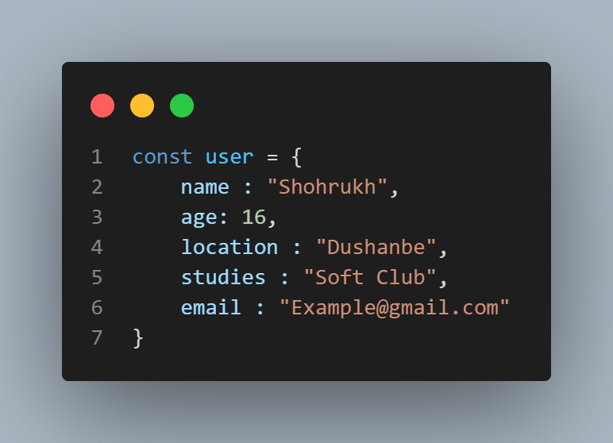
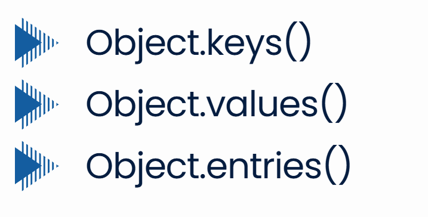
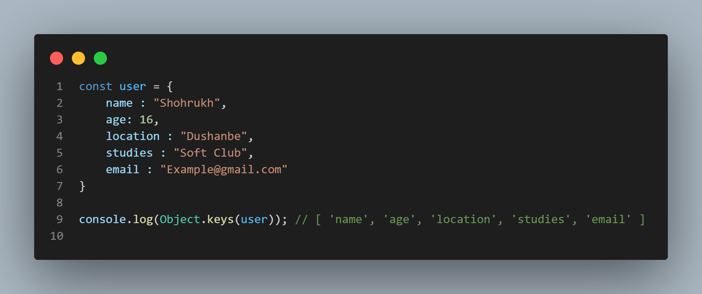
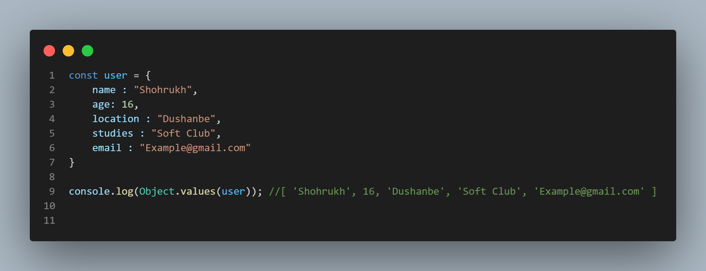
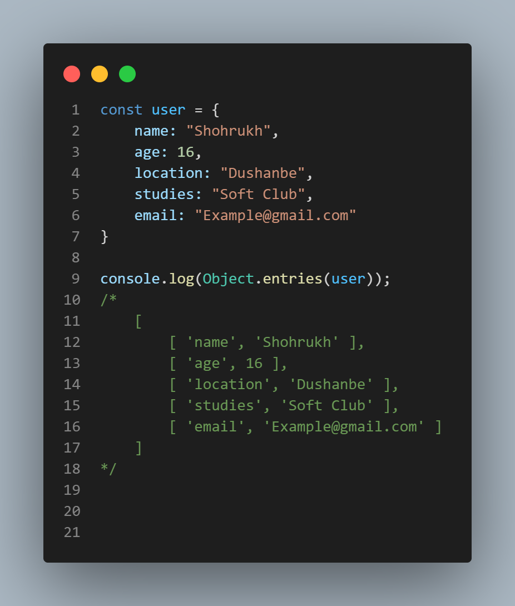
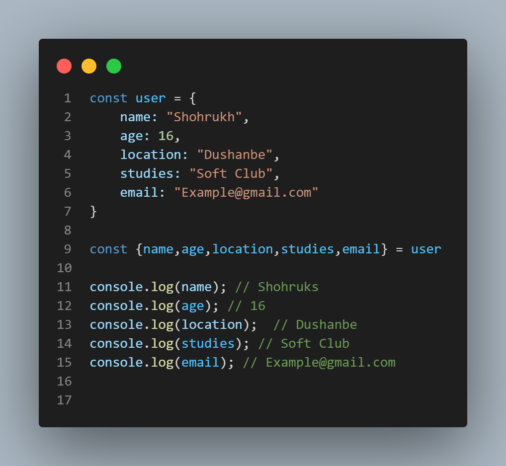

# Object in JS


# Object - Ин набори свойстваҳо мебошад, ки свойстваҳо аз калид(key) ва маълумот(value) иборат мебошад ва баъзан вақтҳо маълумоти свойства функсия шуда метавонад дар ин ҳолат свойства метод ном мегирад.

# Тарзи сохтани объект:


# Object methods:


# Object.keys() 
---
# syntaxis 
```js
Object.keys(object) // [ keys in obj ]
```
---

---


---
# Тарзи кор: методи Object.keys - бамо ҳама калидҳои объектро дар массив бармегардонад.
---

# Object.values()
---
# syntaxis
```js
Object.values(object) // [ returned values in object ]
```
---

---
# Тарзи кор: методи Object.values() - ба ио ҳама маълумотҳоро дар массив бармегардонад.

---

# Object.entries()
---
# syntaxis
```js
Object.entries(object) // returned [ [keys,value] ]
```
---

# Тарзи кор: методи Object.entries() - ба мо ҳама калидҳо ва маълумотҳоро аз объект гирифта ба массиви массивҳо мегардонад.
---

---
# Object mechanizm


# Decturucturing - Аз ҳама роҳи осони маълумотҳоро аз объект гирифтан мебошад ва баъдан ба ба колексияи тағйирёбандаҳо бахшидан. 

# example 



# Keyword 'This'

# Калимаи калидии this дар JavaScript барои ишора кардан ба контексти ҷории иҷрои код истифода мешавад. Контекст аз он вобаста аст, ки функсия чӣ гуна ва дар куҷо иҷро шудааст.

# Хусусиятҳои асосии this: Маънои this аз контекст вобаста аст.
- Дар функсияҳои оддӣ (ғайри-стрелкавӣ), this вобаста ба тарзи иҷроиш таъин мешавад.
- Дар функсияҳои стрелкавӣ (arrow function), this кор намекунад.

```js
function Car(brand, model) {
  this.brand = brand;
  this.model = model;
  this.getDetails = function () {
    return `Автомобиль: ${this.brand} ${this.model}`;
  };
}

const car = new Car("Toyota", "Corolla");
console.log(car.getDetails()); // Автомобиль: Toyota Corolla
```

# бо ҳамин тамом ташаккури зиёд


# барои маълумоти бештар гирифтан ба [линки](https://www.canva.com/design/DAGY-Cztxqs/mYRv4kpEd7i4-ekFgJov0A/view?utm_content=DAGY-Cztxqs&utm_campaign=designshare&utm_medium=link2&utm_source=uniquelinks&utlId=h50da478e86#7) зерин пахш кунед.

